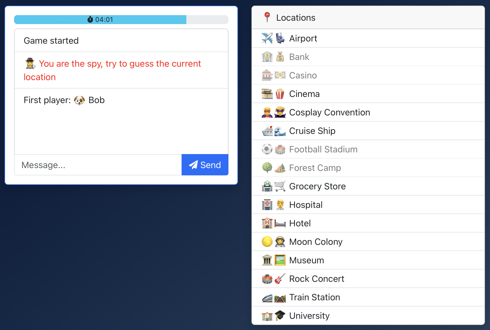

# 🕵️ Spyfall - Client

[](./LICENSE.txt)
[](https://app.netlify.com/sites/heuristic-bartik-850df8/deploys)

A multiplayer social deduction game inspired by [Spyfall](https://hwint.ru/portfolio-item/spyfall/).

[♟️ Play the game](https://spy.verybadfrags.com)

<details>
<summary>🖥️ Game screenshot</summary>

</details>

---

🛠️ Built with [React](https://react.dev),
[Bootstrap](https://getbootstrap.com),
and [socket.io](https://socket.io).

💾 View the server code [here](https://github.com/VeryBadFrags/spyfall-server).

## Run locally

You'll need to run the server locally. See <https://github.com/VeryBadFrags/spyfall-server#run-locally>.

### With [pnpm](https://pnpm.io)

```sh
make dev
```

Run `make` to view all available commands.

### With [npm](https://www.npmjs.com)

```sh
npm run dev
```

## Misc

### Link to Netlify

```sh
pnpm install netlify-cli -g
netlify link
```
